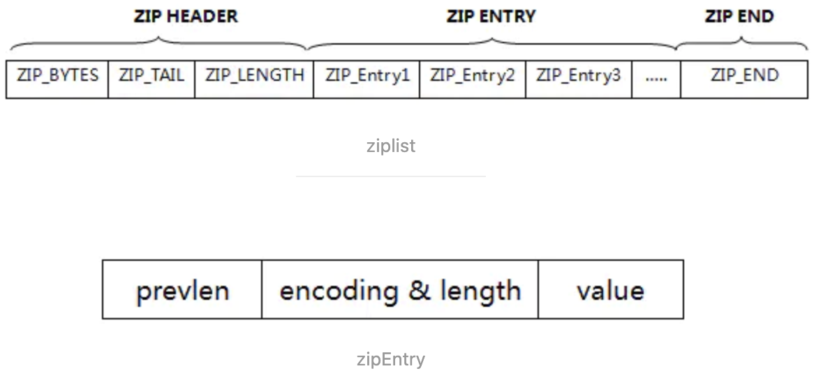
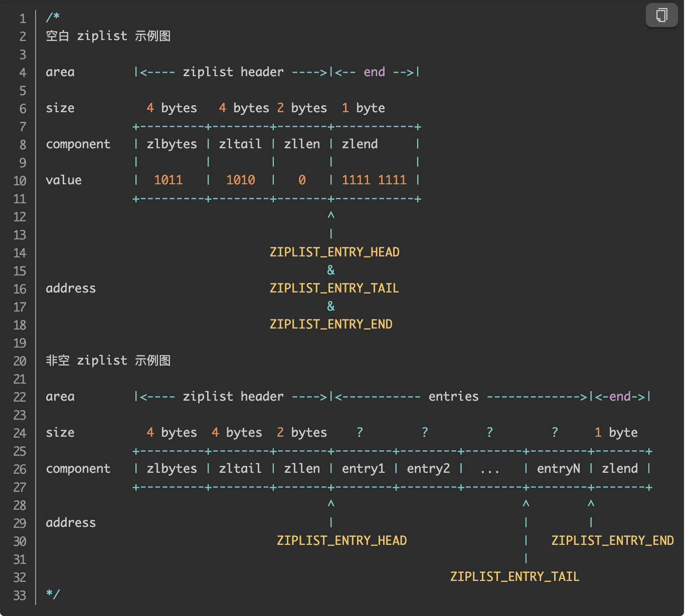
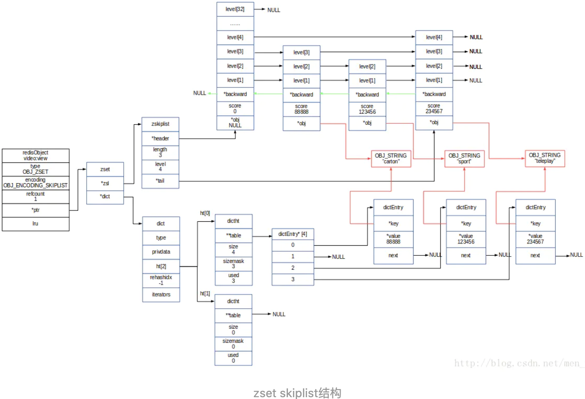

## Redis和Memcache的区别

1. redis支持更丰富的数据类型

   不仅支持简单的K/V类型，同时还提供list，set，zset，hash等数据类型，而memcache只支持string类型

2. redis支持数据的持久化，可以将内存的数据保存在磁盘中，重启的时候再次加载使用，而Memecache把数据全部存在内存中

3. 集群模式

   memcached没有原生的集群模式，需要依靠客户端来实现向集群中分片写入数据，redis原生支持cluster模式

4. memcached是多线程，非阻塞io复用网络模型，redis是单线程的多路IO复用模型

5. Memcache的key不能超过250个字节，value不能超过1M字节

6. Memcache的key的最大失效时间为30天

7. 不支持主从同步


## 为什么Redis能这么快

1. 完全基于内存，绝大部分请求都是存储的内存操作，执行效率高，
2. 数据库结构简单，对数据的操作也简单
3. 采用单线程，单线程也能处理高并发请求，想要多核也可以启动多实例。
4. 使用多路I/O复用模型，非阻塞IO。
5. 采用单线程，避免了不必要的上下文切换和竞争条件，不存在多进程或者多线程导致的切换消耗CPU，不用考虑锁，

### 多路I/O复用模型

I/O 多路复用其实是在单个线程中通过记录跟踪每一个sock（I/O流） 的状态来管理多个I/O流。

#### 多路分离函数select

IO多路复用模型是建立在内核提供的多路分离函数select基础之上的，使用select函数可以避免同步非阻塞IO模型中轮询等待的问题。


​        如上图所示，用户线程发起请求的时候，首先会将socket添加到select中，这时阻塞等待select函数返回。当数据到达时，select被激活，select函数返回，此时用户线程才正式发起read请求，读取数据并继续执行。

​        使用select以后最大的优势是用户可以在一个线程内同时处理多个socket的I/O请求。用户可以注册多个socket，然后不断地调用select读取被激活的socket，即可达到在同一个线程内同时处理多个I/O请求的目的。而在同步阻塞模型中，必须通过多线程的方式才能达到这个目的。

​		该方法的能够同时监控多个文件描述符的可读可写情况，当其中的某些文件描述符可读或者可写时，`select` 方法就会返回可读以及可写的文件描述符个数。

#### Reactor（反应器模式）


​		I/O多路复用模型使用了Reactor设计模式实现了这一机制。通过Reactor的方式，可以将用户线程轮询I/O操作状态的工作统一交给handle_events事件循环进行处理。用户线程注册事件处理器之后可以继续执行做其他的工作（异步），而Reactor线程负责调用内核的select函数检查socket状态。当有socket被激活时，则通知相应的用户线程（或执行用户线程的回调函数），执行handle_event进行数据读取、处理的工作。由于select函数是阻塞的，因此多路I/O复用模型也被称为**异步阻塞I/O模型**。注意，这里的所说的阻塞是指select函数执行时线程被阻塞，而不是指socket。一般在使用I/O多路复用模型时，socket都是设置为NONBLOCK的，不过这并不会产生影响，因为用户发起I/O请求时，数据已经到达了，用户线程一定不会被阻塞。  

##  数据类型

###  String类型

1. 最基本的数据类型，二进制安全

   ~~~shell
   set name "redis" # 设置一个key为name,值为redis的字符串类型的key-value
   get name         # 获取name这个key对应的值
   
   set count 1      # 设置一个key为count值为1的数据
   get count        # 返回字符串 '1'
   incr count       #对count执行 + 1操作，并且是原子性的
   ~~~

2. 保存字符串的结构

   ~~~c
   /*
   * 保存字符串对象的结构
   */
   struct sdshdr {
       
       // buf 中已经占用空间的长度
       int len;
       
       // buf 中剩余可用空间的长度
       int free;
       
       // 数据空间
       char buf[];
   }
   ~~~
   
3. 试用场景

   ~~~doc
   1. 缓存功能:String字符串是最常用的数据类型，不仅仅是Redis，各个语言都是最基本类型，因此，利用Redis作为缓存，配合其他数据库作为存储层，利用Redis支持高并发的特点，可以大大加快系统的读写速度，以及降低后端数据库的压力
   2. 计数器: 许多系统都会使用Redis作为系统的实时计数器，可以快速实现计数和查询的功能。而且最终的数据结果可以按照特定的时间落底到数据库或者其他存储介质当中进行永久保存。
   3.共享用户Session: 用户重新刷新一次界面，可能需要访问一下数据库进行重新登录，或者访问页面缓存Cookie，但是可以利用Redis将用户的Session集中管理，在这种模式下只需要保证Redis的高可用，每次用户Session的更新和获取都可以快速完成，大大提高效率。
   ~~~

4. 扩容

   当字符串长度小于SDS_MAX_PREALLOC (1024*1024)，那么就以2倍的速度扩容，当字符串长度大于SDS_MAX_PREALLOC，那么就以+SDS_MAX_PREALLOC的速度扩容。

### Hash字典类型

1. 操作

   ~~~shell
   hmset Lilei name 'Lilei' age 26 title 'Senior'  # 创建一个Lilie的hash字典
   hget Lilei age                                  #获取lilei的age
   hget Lilei title                                #获取lilei的title
   hset Lilei title 'Pricipal'  # 更新lilei的title
   ~~~
   
2. 底层数据结构

   底层存储可以使用ziplist（压缩列表）和hashtable。当hash对象可以同时满足一下两个条件时，哈希对象使用ziplist编码。

   - 哈希对象保存的所有键值对的键和值的字符串长度都小于64字节
   - 哈希对象保存的键值对数量小于512个

   

   

### List列表

​		按照String元素插入顺序排序

1.  操作

   ~~~shell
   lpush myList aaa
   lpush myList bbb     # 返回当前列表元素的数量
   lrange myList 0 10  # 从左边开始取，取十个，后进先出
   ~~~
   
2. 底层数据结构

   采用**压缩列表ziplist或linkedlist**两种数据结构，首先以ziplist进行存储，在不满足ziplist的存储要求后转换为linkedlist列表。

   

   

### Set集合

​	String元素组成的无序集合，通过哈希表实现，不允许重复

1. 操作

   ~~~shell
   sadd myset 111  # 成功返回1，不成功，即已经存在，返回0
   smembers myset  # 查看myset内的元素，无序
   ~~~
   
2. 底层结构

   底层使用了intset和hashtable两种数据结构存储的，intset可以理解为数组，hashtable就是普通的哈希表（key为set的值，value为null）

   set的底层存储intset和hashtable是存在编码转换的，使用**intset**存储必须满足下面两个条件，否则使用hashtable，条件如下：

   - 结合对象保存的所有元素都是整数值
   - 集合对象保存的元素数量不超过512个

   intset内部其实是一个数组（int8_t coentents[]数组），而且存储数据的时候是有序的，因为在查找数据的时候是通过二分查找来实现的。

### Sorted  Set 有序集合

通过分数（double类型）来为集合中的成员进行从小到大的排序

1. 操作

   ```shell
   zadd myzset 3 adc
   zadd myzset 1 add
   zadd myzset 2 ada   # 第一个为分数，第二个为值，1表示成功 0表示失败
   zrangebyscore myzset  0 10 # 按照分数从小到大取元素，取10个
   ```

2. 底层结构

   zset底层的存储结构包括ziplist或skiplist，在同时满足以下两个条件的时候使用ziplist，其他时候使用skiplist，两个条件如下：

   - 有序集合保存的元素数量小于128个
   - 有序集合保存的所有元素的长度小于64字节

   

### HyperLogLog

用来计数

HyperLogLog 的优点是，在输入元素的数量或者体积非常非常大时，计算基数所需的空间总是固定 的、并且是很小的。

但是，因为 HyperLogLog 只会根据输入元素来计算基数，而不会储存输入元素本身，所以 HyperLogLog 不能像集合那样，返回输入的各个元素。

~~~shell
 PFADD runoobkey "redis" # 添加
 PFCOUNT runoobkey  # 查看个数
~~~

### Geo

用于支持存储地理位置信息的

### 底层数据类型基础

1. 简单动态字符串
2. 链表
3. 字典
4. 跳跃表
5. 整数集合
6. 压缩列表
7. 对象

## 查询

### 取固定前缀的key

1. keys 

   查找所有符合指定模式pattern的key

   ```shell
   dbsize # 查找当前库中的key的数量
   keys k1*  # 返回所有以k1开头的key的值，但是会阻塞
   ```

   缺点：

   1、一次性返回所有符合条件的key

   2、键的数量过大会使服务卡顿

2.  SCAN（推荐）

   ```shell
   SCAN cursor 【MATCH pattern】 【COUNT count】 # cursor 游标，pattern 模式，count 数量
   ```

   优点：

   1、基于游标的迭代器，需要基于 上一次的游标延续之前的迭代过程

   2、以0作为有标开始一次新的迭代，直到命令返回游标0完成一次遍历。

   3、不保证每次执行都返回某个给定数量的元素，支持模糊查询

   4、一次返回的数量不可控，只能是大概率符合count参数

   ```shell
   scan 0 match k1* count 10 #开始迭代，返回以k1开头的key，希望数量为10个
   # 返回结果为两个 第一个是下一个的游标，第二个是一个list 结果集
   ```


## 实现分布式锁

### 解决问题

1. 互斥性

   任何时间，只能有一个客户端获取到锁

2. 安全性

   锁只能被持有该锁的客户端删除，

3. 死锁

   获取锁的客户端不正常宕机，其他客户端无法获取到锁

4. 容错

   当部分节点宕机的时候，客户端仍然能获取锁，释放锁

### 实现过程

1. setnx key value

   如果key不存在，创建并赋值

   时间复杂度为O(1)

   设置成功返回1，设置失败返回0

2. 解决setnx长期有效问题：expire key timeout 

   设置key的过期时间
   
   setnx lockKey 1
   
3. 使用set 操作实现setnx + expire的一步原子性操作

   ~~~shell
   set key value 【EX seconds】【PX milliseconds】【NX|XX】 # 设置键的过期时间为seconds秒 设置键的过期时间为milliseconds毫秒，nx只在键不存在的时，才对键进行设置操作（等同于setnx）， xx只在键已经存在时，才对键进行设置操作。
   # 成功返回ok，失败返回nil
   
   ~~~

set lockTarget  12345 ex 10 nx                 #设置key为lockTarget，值为12345的数据 设置过期时间为10s.如果不存在才设置。
## 大量key过期时间一致的问题

问题：    如果大量的key同一时间过期，会导致卡顿现象，

解决方案:在设置key的过期时间的时候，给每个key加上随机值。这样就能分散控制key的过期时间。

## 使用redis实现异步队列

1. 使用List作为队列，Rpush生产消息，LPOP消费消息

   ~~~shell
   rpush testList aaa       # 生产消息
   lpop testList            # 消费消息
   blpop testList timeout   #阻塞直到队列有消息或者超时
   ~~~

   缺点：

   1. 没有等待有值就去消费，
   2. 可以通过在应用层引入sleep机制去调用lpop去重试
   3. 只能实现一对一的模式，消费过一次后就没有了

2. pub/sub 主题订阅者模式

   实现一对多的模式

   订阅者可以定义任意数量的主题（topic）

   ~~~ shell
   subscribe myTopic              # 订阅该主题的数据，不要求该主题存在
   publish  myTopic 'hello'       # 发布消息,在mytopic中
   ~~~

   缺点：

   1. 发布的消息是无状态的，不能保证可达
   2. 消费者下线后接收不到消息

## 分布式系统中的主键生成问题---雪花算法

​		雪花算法(SnowFlake)，是Twitter开源的分布式id生成算法，其核心思想是：使用一个**64bit**的long型的数字作为全局唯一的id，在分布式系统中的应用十分广泛，且**ID引入了时间戳，基本上保持了自增。**

​		在这64个bit中，其中1个bit是不用的，然后其中的41bit作为毫秒数，用10bit作为工作机器id，12bit作为序列号。


这个图片分析如下

- 第一部分，1个bit： 0 这个是无意义的
- 第二部分，41个bit：表示的是时间戳
- 第三部分，5个bit：表示的机房id，10001
- 第四部分，5个bit：表示的是机器id，11001
- 第五部分，12个bit：表示的是序号，就是某个机房某台机器上这一毫秒内同时生成的id的序号

1. **第一部分的1bit为什么不用**

   因为二进制里第一个bit如果为1，那么就是负数，但是我们生成的id都是正数，所以第一个bit统一为0

2. 第二部分41bit，表示时间错

   41 bit 可以表示的数字多达 2^41 - 1，也就是可以标识 2 ^ 41 - 1 个毫秒值，换算成年就是表示 69 年的时间

3. **第三部分和第四部分**

   **记录工作机器id，代表的是这个服务最多可以部署在2^10台机器上，也就是1024台服务器**

   但是 10 bit 里 5 个 bit 代表机房 id，5 个 bit 代表机器 id。意思就是最多代表 2 ^ 5 个机房（32 个机房），每个机房里可以代表 2 ^ 5 个机器（32 台机器），也可以根据自己公司的实际情况确定。

4. 最后一部分

   **这个是用来记录同一个毫秒内产生的不同 id。**

   12 bit 可以代表的最大正整数是 2 ^ 12 - 1 = 4096，也就是说可以用这个 12 bit 代表的数字来区分同一个毫秒内的 4096 个不同的 id。

### 优点

（1）高性能高可用：生成时不依赖于数据库，完全在内存中生成。

（2）容量大：每秒中能生成数百万的自增ID。

（3）ID自增：存入数据库中，索引效率高。

### 缺点

1. 依赖与系统时间的一致性，如果系统时间被回调，或者改变，可能会造成id冲突或者重复。

2. 实际中我们的机房并没有那么多，我们可以改进改算法，将10bit的机器id优化成业务表或者和我们系统相关的业务。

### 实现代码示例

~~~java
package com.fcbox.fms.util;
 
public class IdWorker {
 
	//因为二进制里第一个 bit 为如果是 1，那么都是负数，但是我们生成的 id 都是正数，所以第一个 bit 统一都是 0。
 
	//机器ID  2进制5位  32位减掉1位 31个
	private long workerId;
	//机房ID 2进制5位  32位减掉1位 31个
	private long datacenterId;
	//代表一毫秒内生成的多个id的最新序号  12位 4096 -1 = 4095 个
	private long sequence;
	//设置一个时间初始值    2^41 - 1   差不多可以用69年
	private long twepoch = 1585644268888L;
	//5位的机器id
	private long workerIdBits = 5L;
	//5位的机房id
	private long datacenterIdBits = 5L;
	//每毫秒内产生的id数 2 的 12次方
	private long sequenceBits = 12L;
	// 这个是二进制运算，就是5 bit最多只能有31个数字，也就是说机器id最多只能是32以内
	private long maxWorkerId = -1L ^ (-1L << workerIdBits);
	// 这个是一个意思，就是5 bit最多只能有31个数字，机房id最多只能是32以内
	private long maxDatacenterId = -1L ^ (-1L << datacenterIdBits);
 
	private long workerIdShift = sequenceBits;
	private long datacenterIdShift = sequenceBits + workerIdBits;
	private long timestampLeftShift = sequenceBits + workerIdBits + datacenterIdBits;
	private long sequenceMask = -1L ^ (-1L << sequenceBits);
	//记录产生时间毫秒数，判断是否是同1毫秒
	private long lastTimestamp = -1L;
	public long getWorkerId(){
		return workerId;
	}
	public long getDatacenterId() {
		return datacenterId;
	}
	public long getTimestamp() {
		return System.currentTimeMillis();
	}
 
 
 
	public IdWorker(long workerId, long datacenterId, long sequence) {
 
		// 检查机房id和机器id是否超过31 不能小于0
		if (workerId > maxWorkerId || workerId < 0) {
			throw new IllegalArgumentException(
					String.format("worker Id can't be greater than %d or less than 0",maxWorkerId));
		}
 
		if (datacenterId > maxDatacenterId || datacenterId < 0) {
 
			throw new IllegalArgumentException(
					String.format("datacenter Id can't be greater than %d or less than 0",maxDatacenterId));
		}
		this.workerId = workerId;
		this.datacenterId = datacenterId;
		this.sequence = sequence;
	}
 
	// 这个是核心方法，通过调用nextId()方法，让当前这台机器上的snowflake算法程序生成一个全局唯一的id
	public synchronized long nextId() {
		// 这儿就是获取当前时间戳，单位是毫秒
		long timestamp = timeGen();
		if (timestamp < lastTimestamp) {
 
			System.err.printf(
					"clock is moving backwards. Rejecting requests until %d.", lastTimestamp);
			throw new RuntimeException(
					String.format("Clock moved backwards. Refusing to generate id for %d milliseconds",
							lastTimestamp - timestamp));
		}
 
		// 下面是说假设在同一个毫秒内，又发送了一个请求生成一个id
		// 这个时候就得把seqence序号给递增1，最多就是4096
		if (lastTimestamp == timestamp) {
 
			// 这个意思是说一个毫秒内最多只能有4096个数字，无论你传递多少进来，
			//这个位运算保证始终就是在4096这个范围内，避免你自己传递个sequence超过了4096这个范围
			sequence = (sequence + 1) & sequenceMask;
			//当某一毫秒的时间，产生的id数 超过4095，系统会进入等待，直到下一毫秒，系统继续产生ID
			if (sequence == 0) {
				timestamp = tilNextMillis(lastTimestamp);
			}
 
		} else {
			sequence = 0;
		}
		// 这儿记录一下最近一次生成id的时间戳，单位是毫秒
		lastTimestamp = timestamp;
		// 这儿就是最核心的二进制位运算操作，生成一个64bit的id
		// 先将当前时间戳左移，放到41 bit那儿；将机房id左移放到5 bit那儿；将机器id左移放到5 bit那儿；将序号放最后12 bit
		// 最后拼接起来成一个64 bit的二进制数字，转换成10进制就是个long型
		return ((timestamp - twepoch) << timestampLeftShift) |
				(datacenterId << datacenterIdShift) |
				(workerId << workerIdShift) | sequence;
	}
 
	/**
	 * 当某一毫秒的时间，产生的id数 超过4095，系统会进入等待，直到下一毫秒，系统继续产生ID
	 * @param lastTimestamp
	 * @return
	 */
	private long tilNextMillis(long lastTimestamp) {
 
		long timestamp = timeGen();
 
		while (timestamp <= lastTimestamp) {
			timestamp = timeGen();
		}
		return timestamp;
	}
	//获取当前时间戳
	private long timeGen(){
		return System.currentTimeMillis();
	}
 
	/**
	 *  main 测试类
	 * @param args
	 */
	public static void main(String[] args) {
		System.out.println(1&4596);
		System.out.println(2&4596);
		System.out.println(6&4596);
		System.out.println(6&4596);
		System.out.println(6&4596);
		System.out.println(6&4596);
//		IdWorker worker = new IdWorker(1,1,1);
//		for (int i = 0; i < 22; i++) {
//			System.out.println(worker.nextId());
//		}
	}
}
~~~


## Redis持久化

### RDB(快照)持久化

  保存某个时间点的全量数据快照

 @ 相关配置

~~~ shell
save 900 1         # 900s内有一条是写入指令，就进行一次快照
save 300 10        # 300s内有十条写入，就进行一次快照
save 60 10000      # 60s内有一万条写入，就进行一次快照
stop-writes-on-bgsave-error yes # 设置成yes表示当备份进程出错时，主进程就停止接收新的写入操作。
rdbcompression yes   # 在备份时将rdb文件压缩后在进行保存，建议设置成no，因为redis属于cpu密集型服务器，在开启压缩后会带来cpu压力
~~~

@指令

~~~shell
SAVE    # 阻塞redis的服务器进程，知道RDB文件被创建完成，很少使用。
BGSAVE  # Fork出一个子进程来创建RDB文件,不阻塞服务器进程。
lastsave # 返回上次保存的时间戳
~~~

@ 自动触发RDB持久化的方式

1. 分局redis.conf配置里的SAVE m n 定时触发（用的是BGSAVE)
2. 从节点复制时，主节点发送rdb文件给从节点，主节点自动触发
3. 执行Debug Reload
4. 执行shutdown且没有开启AOF持久化

@ BGSAVE原理


系统调用fork（）创建进程，并且实现了Copy-on-Write

@Copy-on-Write（写时复制）

如果有多个调用者同时要求相同资源（如内存或磁盘上的数据存储），他们会共同获取相同的指针指向相同的资源，直到某个调用者试图修改资源的内容时，系统才会真正复制一份专用副本给该调用者，而其他调用者所见到的最初的资源仍然保持不变。

@ 缺点

1. 内存数据的全量同步，数据量大会由于I/O而严重影响性能
2. 可能会因为Redis挂掉而丢失从当前值最近一次快照期间的所有数据

### AOF（append -only-file）持久化

  @ 记录除了查询以外的所有变更数据库状态的指令

  @ 以append的形式保存到AOF文件中（增量）

  @ 默认是关闭的

~~~shell
appdendonly no # 默认是关闭的  在redis.conf中更改为yes可打开AOF方式
appendfsync everysec  # 配置更新的方式，--always(一旦发生变化就将缓存变化写入AOF中)  -- everysec(推荐)(将缓存区的内容每一秒都写入AOF文件中) -- no(将写入的操作交给操作系统，一般系统会在缓冲区被填满才同步到磁盘中)
~~~

@ 日志重写解决AOF文件大小不断增大的问题

  原理:

1.  调用fork()，创建一个子进程
2. 子进程把新的AOF写到一个临时文件里，不依赖原来的AOF文件
3. 主进程持续将新的变动同时写到内存和原来的AOF中
4. 主进程获取子进程AOF的完成信号，往新AOF同步增量变动
5. 用新的AOF文件替换掉旧的AOF文件

### 优缺点对比

1. RDB
   1. 优点：全数据量快照，文件小，二进制存储，恢复快
   2. 缺点：无法保存最近一次的快照之后的数据
2. AOF
   1. 优点：可读性高，适合保存增量数据，数据不易丢失丢失数据时，最多丢失一次数据，
   2. 缺点：文件体积大，恢复时间长。

### RDB-AOF混合持久化方式（默认）


## Pipeline

@ Pipeline类似于Linux的管道

@ Redis基于请求/相应模式，单个请求处理需要一一应答

@ Pipeline批量执行指令，节省多次IO往返的时间

@ 有顺序依赖的指令建议分批发送

**使用redis-benchmark进行压测的时候可以发现影响redis的QPS峰值的一个重要因素是pipeline批次指令的数目。**

## Redis主从同步机制

1. 全同步过程
   1. Slave发送**psync**命令到Master
   2. Master启动一个后台进程，将Redis中的数据快照BGSAVE【Redis Bgsave 命令用于在后台异步保存当前数据库的数据到磁盘。BGSAVE 命令执行之后立即返回 OK ，然后 Redis fork 出一个新子进程，原来的 Redis 进程(父进程)继续处理客户端请求，而子进程则负责将数据保存到磁盘，然后退出。】保存到文件中，
   3. Master将保存快照期间受到的写命令缓存起来
   4. Master完成写文件操作后，将该文件发送给Slave
   5. Slave使用新的RDB文件替换掉旧的RDB文件
   6. Master将这期间收集到的增量写命令发送给Slave端
2. 增量同步过程
   1. Master接收到用户的操作命令后，判断是否需要传播到Slave，
   2. 将操作记录到AOF文件中
   3. 将操作传播到其他Slave中
      1. 对齐主从库
      2. 往响应缓存中写入指令
   4. 将缓存中的数据发送给Slave
3. Redis Sentinel（哨兵）
   1. 解决了主从同步Master宕机后的主从切换问题
      1. 监控：检查主从服务器是否运行正常
      2. 提醒：通过API向管理员或其他应用程序发送故障通知
      3. 自动故障迁移：主从切换
4. 流言协议Gossip
   1. 在杂乱无章中寻求一致
   2. 每个节点都随机地与对方通信，最终所有节点的状态达成一致
   3. 种子节点定期随机向其他节点发送节点列表以及需要传播的消息
   4. 不保证信息一定会传递给所有节点，但是最终会趋于一致

## Redis集群主节点选举机制

- **选举过程**

  1. 主观下线

     集群中的每一个Sentinel节点会对redis集群的所有节点发心跳包检测节点是否正常。如果一个节点在`down-after-milliseconds`时间内没有回复Sentinel节点的心跳包，则该节点被Sentinel节点主观下线

  2. 客观下线

     当节点被一个sentinel节点标记为主观下线后，并不意味着这个节点真正的下线了，还需要Sentinel集群的其他sentinel节点共同判断为主观下线才行

     该sentinel节点会询问其他sentinel节点，如果sentinel集群中超过`quorum`数量的sentinel节点也认为该redis节点主观下线了，则该redis节点客观下线

     如果客观下线的redis节点是从节点或者Sentinel节点，则操作结束，**如果客观下线的redis节点为主节点，则开始故障转移，从从节点中选举一个节点升级为主节点**

  3. **Sentinel集群选举Leader**

     如果需要从redis集群中选举一个节点为主节点，首先需要从sentinel集群中选举一个Sentinel节点作为Leader

     每一个Sentinel节点都可以成为Leader，**当一个Sentinel节点确认redis集群的主节点主观下线后，会请求其他Sentinel节点要求将自己选举为Leader。被请求的Sentinel节点如果没有同意过其他Sentinel节点的选举请求，则同意该请求(选举票数+1)，否则不同意**

     如果一个sentinel节点获得的选举票数达到Leader的最低票数`Math.max(quorum,Sentinel节点数 / 2  + 1)`， 则该sentinel节点选举为Leader，否则重新进行选举

     

  4. ### Sentinel Leader决定新主节点

     当Sentinel集群选举出Sentinel Leader后，**由Sentinel Leader从redis从节点中选择一个redis节点作为主节点：**

     1. 过滤故障节点
     2. 选择优先级`slave-priority`最大的节点最为主节点，如不存在则继续
     3. 选择复制偏移量（数据写入量的节点，记录写了多少数据，主服务器会把偏移量同步给从服务器，当主从服务器的偏移量一致，则数据完全同步）**最大**的从节点作为主节点，如不存在则继续
     4. 选择`runId`（redis每次启动的时候生成随机的runId作为redis的标识）**最小**的从节点作为主节点

  5. **为什么Sentinel集群至少3个节点**

     一个Sentinel节点选举为Leader的最低票数为`quorum`和`Sentinel节点数/2+1`的最大值，如果Sentinel集群只有两个Sentinel节点，则

     ~~~java
     Sentinel节点数/2 + 1
     = 2/2 + 1
     = 2
     ~~~

     即Leader最低票数至少为2，当该Sentinel集群中由一个Sentinel节点故障后，仅剩的一个Sentinel节点是永远无法成为Leader。

     也可以由此公式可以推导出，Sentinel集群允许1个Sentinel节点故障则需要3个节点的集群；允许2个节点故障则需要5个节点集群。

## Redis集群

@ 如何从海量数据中快速找到所需

1. 分片：按照某种规则去划分数据，分散存储在多个节点上，采用无中心结构，每个节点保存数据和整个集群的状态，每个节点都和其他节点连接，通过Gossip协议传播信息，以及发现新的节点。
2. 通常通过获取key的hash值，根据节点数来进行求模，缺点是无法动态实现节点的动态增减，会造成大量key无法命中
3. 一致性hash算法，
   1. 普通hash是对节点数量取模，
   2. 一致性hash是对2^32取模，将哈希值空间组织成虚拟的圆环
   3. 在对数据key计算出hash值后，在圆环上顺时针寻找，找到的第一个节点即为该数据的存储节点
   4. 在某些节点宕机后，其他节点不会影响，该节点数据被顺延存储到下一个节点上
   5. 缺点：
      1. 在节点数据量少的时候，会出现hash的倾斜性：节点都在右边，会导致一个节点爆炸
      2. 引入虚拟节点，让hash分布均匀一些

### Cache Aside Pattern

经典的缓存 + 数据库读写的模式

1. 读的时候，先读缓存，缓存没有，在读数据库，然后取出数据库放入缓存，同时返回响应。
2. 更新的时候，**先更新数据库，然后再删除缓存**。
   1. 为什么是删除缓存不是更新
      1. 在复杂点的缓存场景，缓存不单单是数据库中直接取出来的值。
      2. 运用 Lazy 计算的思想，在用到的时候再去进行计算

**问题**

先修改数据库，再删除缓存。**如果删除缓存失败了，那么会导致数据库中是新数据，缓存中是旧数据，数据就出现了不一致。**

**方案**

**先删除缓存，再修改数据库**。如果数据库修改失败了，那么数据库中是旧数据，缓存中是空的，那么数据不会不一致。因为读的时候缓存没有，则读数据库中旧数据，然后更新到缓存中。

**问题**

数据发生了变更，先删除了缓存，然后要去修改数据库，此时还没修改。一个请求过来，去读缓存，发现缓存空了，去查询数据库，**查到了修改前的旧数据**，放到了缓存中。随后数据变更的程序完成了数据库的修改。完了，数据库和缓存中的数据不一样了
**方案**

更新数据的时候，根据**数据的唯一标识**，将操作路由之后，发送到一个 jvm 内部队列中。读取数据的时候，如果发现数据不在缓存中，那么将重新读取数据+更新缓存的操作，根据唯一标识路由之后，也发送同一个 jvm 内部队列中。

一个队列对应一个工作线程，每个工作线程**串行**拿到对应的操作，然后一条一条的执行。这样的话，一个数据变更的操作，先删除缓存，然后再去更新数据库，但是还没完成更新。此时如果一个读请求过来，读到了空的缓存，那么可以先将缓存更新的请求发送到队列中，此时会在队列中积压，然后同步等待缓存更新完成。

这里有一个**优化点**，一个队列中，其实**多个更新缓存请求串在一起是没意义的**，因此可以做过滤，如果发现队列中已经有一个更新缓存的请求了，那么就不用再放个更新请求操作进去了，直接等待前面的更新操作请求完成即可。

待那个队列对应的工作线程完成了上一个操作的数据库的修改之后，才会去执行下一个操作，也就是缓存更新的操作，此时会从数据库中读取最新的值，然后写入缓存中。

如果请求还在等待时间范围内，不断轮询发现可以取到值了，那么就直接返回；如果请求等待的时间超过一定时长，那么这一次直接从数据库中读取当前的旧值。


## Redis的内存淘汰机制

- 定期删除

  定期随机抽取一些设置了过期时间的key，检查是否过期

- 惰性删除

  不主动删，等查询的时候查看是否过期

- 内存淘汰机制

  - noeviction当内存达到限制，并且客户端尝试执行使用内存的命令时，返回错误
  - allkeus-lru回收最少使用的key
  - volatile-lru在过期集合的key中回收最少使用的key
  - allkeys-random随机回收key
  - volatile-random在过期集合的key中随机回收
  - volatile-ttl在过期集合中，优先回收存活时间较短的key

## Lua

**Lua** 脚本功能是 Reids在 2.6 版本的最大亮点， 通过内嵌对 Lua 环境的支持， Redis 解决了长久以来不能高效地处理 **CAS** （check-and-set）命令的缺点， 并且可以通过组合使用多个命令， 轻松实现以前很难实现或者不能高效实现的模式。

Lua脚本类似于Redis事务，有一定的原子性，不会被其他命令插队。可以完成一些Redis事务性的操作. 

编写脚本去支持获取库存和更改库存的操作

## 秒杀系统的设计


### 秒杀中的redis缓存预测问题

- 提前给redis中嵌入部分数据，在提供服务

- 肯定不可能将所有数据都写入redis，因为数据量太大了，第一耗费的时间太长了，第二redis根本就容纳不下所有的数据

- 需要更具当天的具体访问情况，试试统计出频率较高的热数据

- 然后将访问频率较高的热数据写入到redis，肯定是热数据也比较多，我们也得多个服务并行的读取数据去写，并行的分布式的缓存预热

- 然后将嵌入的热数据的redis对外提供服务，这样就不至于冷启动，直接让数据库奔溃了

- 具体的实时方案：

  1. nginx+lua将访问量上报到kafka中

  要统计出来当前最新的实时的热数据是哪些，我们就得将商品详情页访问的请求对应的流量，日志，实时上报到kafka中，

  2. storm从kafka中消费数据，实时统计出每个商品的访问次数，访问次数基于LRU内存数据结构的存储方案

  优先用内存中的一个LRUMap去存放，性能高，而且没有外部依赖

  否则的话，依赖redis,我们就是要防止reids挂掉数据丢失的情况，就不合适了；用mysql，扛不住高并发读写；用hbase，hadoop生态系统，维护麻烦，太重了，其实我们只要统计出一段时间访问最频繁的商品，然后对它们进行访问计数，同时维护出一个前N个访问最多的商品list即可

  计算好每个task大致要存放的商品访问次数的数量，计算出大小，然后构建一个LURMap,apache commons collections有开源的实现，设定好map的最大大小，就会自动根据LRU算法去剔除多余的数据，保证内存使用限制，即使有部分数据被干掉了，然后下次来重新开始技术，也没什么关系，因为如果他被LRU算法干掉，那么它就不是热数据，说明最近一段时间很少访问，

  3. 每个storm task启动的时候，基于zk分布式锁，将自己的id写入zk的一个节点中
  4. 每个storm task负责完成自己这里的热数据的统计，比如每次计数过后，维护一个钱1000个商品的list，每次计算完都更新这个list
  5. 写一个后台线程，每个一段时间，比如一分钟，将排名钱1000的热数据list,同步到zk中

### 秒杀系统的动静分离

所谓“动静分离”，其实就是把用户请求的数据（如 HTML 页面）划分为“动态数据”和“静态数据”。

简单来说，**“动态数据”和“静态数据”的主要区别就是看页面中输出的数据是否和 URL、浏览者、时间、地域相关，以及是否含有 Cookie 等私密数据**。比如说：

很多媒体类的网站，某一篇文章的内容不管是你访问还是我访问，它都是一样的。所以它就是一个典型的静态数据，但是它是个动态页面。

我们如果现在访问淘宝的首页，每个人看到的页面可能都是不一样的，淘宝首页中包含了很多根据访问者特征推荐的信息，而这些个性化的数据就可以理解为动态数据了。

分离了动静数据，我们就可以对分离出来的静态数据做缓存，有了缓存之后，静态数据的“访问效率”自然就提高了。

如何对静态数据进行缓存

**第一，你应该把静态数据缓存到离用户最近的地方**。静态数据就是那些相对不会变化的数据，因此我们可以把它们缓存起来。缓存到哪里呢？常见的就三种，用户浏览器里、CDN 上或者在服务端的 Cache 中。你应该根据情况，把它们尽量缓存到离用户最近的地方。

**第二，静态化改造就是要直接缓存 HTTP 连接**。相较于普通的数据缓存而言，你肯定还听过系统的静态化改造。静态化改造是直接缓存 HTTP 连接而不是仅仅缓存数据，如下图所示，Web 代理服务器根据请求 URL，直接取出对应的 HTTP 响应头和响应体然后直接返回，这个响应过程简单得连 HTTP 协议都不用重新组装，甚至连 HTTP 请求头也不需要解析。


第三，让谁来缓存静态数据也很重要。不同语言写的 Cache 软件处理缓存数据的效率也各不相同。以 Java 为例，因为 Java 系统本身也有其弱点（比如不擅长处理大量连接请求，每个连接消耗的内存较多，Servlet 容器解析 HTTP 协议较慢），所以你可以不在 Java 层做缓存，而是直接在 Web 服务器层上做，这样你就可以屏蔽 Java 语言层面的一些弱点；而相比起来，Web 服务器（如 Nginx、Apache、Varnish）也更擅长处理大并发的静态文件请求。

如何做动静分离的改造

1. 静态数据的处理

   1. **URL 唯一化**。商品详情系统天然地就可以做到 URL 唯一化，比如每个商品都由 ID 来标识，那么 http://www.aaaa.com/item.htm?id=xxxx 就可以作为唯一的 URL 标识。为啥要 URL 唯一呢？前面说了我们是要缓存整个 HTTP 连接，那么以什么作为 Key 呢？就以 URL 作为缓存的 Key，例如以 id=xxx 这个格式进行区分。
   2. **分离浏览者相关的因素**。浏览者相关的因素包括是否已登录，以及登录身份等，这些相关因素我们可以单独拆分出来，通过动态请求来获取。
   3. **分离时间因素**。服务端输出的时间也通过动态请求获取。
   4. **异步化地域因素**。详情页面上与地域相关的因素做成异步方式获取，当然你也可以通过动态请求方式获取，只是这里通过异步获取更合适。
   5. **去掉 Cookie**。服务端输出的页面包含的 Cookie 可以通过代码软件来删除，如 Web 服务器 Varnish 可以通过 unset req.http.cookie 命令去掉 Cookie。注意，这里说的去掉 Cookie 并不是用户端收到的页面就不含 Cookie 了，而是说，在缓存的静态数据中不含有 Cookie。

2. 动态数据的处理

   1. **ESI 方案（或者 SSI）**

      即在 Web 代理服务器上做动态内容请求，并将请求插入到静态页面中，当用户拿到页面时已经是一个完整的页面了。这种方式对服务端性能有些影响，但是用户体验较好。

   2. **CSI 方案**

      即单独发起一个异步 JavaScript 请求，以向服务端获取动态内容。这种方式服务端性能更佳，但是用户端页面可能会延时，体验稍差。

## 布隆过滤器

​       本质上是位数组，存入布隆过滤器的数据只占一位。缺点是其返回的结果是概率性的，而且不是非常准确。

​        当元素加入到布隆过滤器的时候。

1. 使用布隆过滤器中的哈希函数对元素值进行计算，得到哈希值(有几个哈希函数得到几个哈希值)

2.  根据哈希值，在位数组中吧对应下标的值置为1

   当我们需要判断一个元素是否存在于布隆过滤器的时候，进行如下操作

   1. 对给定元素进行相同的哈希计算
   2. 得到值之后判断位数组中的每个元素是否都为1.

## 容灾机制

### 缓存雪崩

- 原因

  大量的key在同一时间失效，并且此时大量的请求都进来，直接请求到数据库中，导致数据库崩溃

- 方法

  - 对key的过期时间加上random，区分过期时间，不要同一时间过期
  - 对于热点数据不设置过期时间
  - 集群部署，将热点数据部署在不同redis库中
  - 事中： 本地ehcache缓存， hystrix限流，降级，避免mysql崩掉
  - 事后：利用redis持久化机制保存的数据尽快恢复缓存

#### JAVA限流方法

- **令牌桶算法**

  原理：系统以一个恒定的速度往桶中放入令牌，**如果请求需要被处理，则需要先从桶里获取一个令牌，当桶中没有令牌可取的时候，则拒绝服务，当桶满的时候，新添加的令牌被丢弃掉或者拒绝**

  ~~~java
  public class RateLimiterDemo{
      // 每一秒产生5个令牌，每200毫秒产生一个
      private static RateLimiter limiter = RateLimiter.create(5);
      
      public static void exec(){
          // 消费一个令牌，当桶中有足够的令牌时，则直接返回0，否则阻塞，直到有可用的令牌数才返回，返回的值为阻塞的时间。
          limiter.acquire(1);
          try{
              // 处理核心逻辑
              TimeUnit.SECONDS.sleep(1);
          }catch(InterruptedException  e){
              e.printStackTrace();
          }
      }
  }
  ~~~

- **漏桶算法**

  主要目的是控制数据注入到网络的速率，平滑网络上的突发流量，数据可以以任意速度流入到漏桶中。漏桶算法提供了一种机制，通过它，突发流量可以被整形以便为网络提供一个稳定的流量。 漏桶可以看作是一个带有常量服务时间的单服务器队列，如果漏桶为空，则不需要流出水滴，如果漏桶（包缓存）溢出，那么水滴会被溢出丢弃

- 计数器限流法

  ~~~java
  public class CountRateLimiterDemo2 {
   
      private static Semaphore semphore = new Semaphore(5);
   
      public static void exec() {
          if(semphore.getQueueLength()>100){
              System.out.println("当前等待排队的任务数大于100，请稍候再试...");
          }
          try {
              semphore.acquire();
              // 处理核心逻辑
              TimeUnit.SECONDS.sleep(1);
              System.out.println("--" + System.currentTimeMillis() / 1000);
          } catch (InterruptedException e) {
              e.printStackTrace();
          } finally {
              semphore.release();
          }
      }
  }
  ~~~

  使用Semaphore信号量来控制并发执行的次数，如果超过域值信号量，则进入阻塞队列中排队等待获取信号量进行执行。如果阻塞队列中排队的请求过多超出系统处理能力，则可以在拒绝请求。

  如果是瞬时的高并发，可以**使请求在阻塞队列中排队，而不是马上拒绝请求**，从而达到一个流量削峰的目的。

### 缓存穿透

- 原因

请求缓存和数据库中都没有的数据，如id 为 -1的值，redis中不存在，相当于绕过redis，每次都是请求数据库，导致数据库压力过大，击垮数据库，基本上都是攻击者

- 方法

  - 接口层进行校验

  - BoomFilter（布隆过滤器）

    ​         使用高效的数据结构和算法判断出这个key是否在数据库中，不存在直接return，存在就查DB，刷新缓存再return

    ​		布隆过滤器的实现方式

    ​				将所有可能存在的数据哈希到一个足够大的bitmap中，一个一定不存在的数据会被这个bitmap拦截掉，从而避免了对底层存储系统的查询压力

  - 另外一种方式，如果一个查询的结果为空，我们仍然把这个空结果进行缓存，但他的过期时间很短

### 缓存击穿

- 原因

  类似于雪崩，雪崩是大面积的缓存失效，打崩DB，缓存击穿是一个key很热点，在不停的扛着大并发，当这个key失效的瞬间，持续的大并发击穿缓存，请求数据库

- 方法

  - 设置热点数据永不过期
  - 加互斥锁

### 容灾的处理

- 事前

  redis高可用，主从 + 哨兵， redis cluster，避免全盘崩溃

- 事中

  本地echache缓存，hystrix限流 + 降级，避免mysql被打死

- 事后

  redis持久化RDB + AOF，一旦重启，自动从磁盘上加载数据，回复缓存数据。

